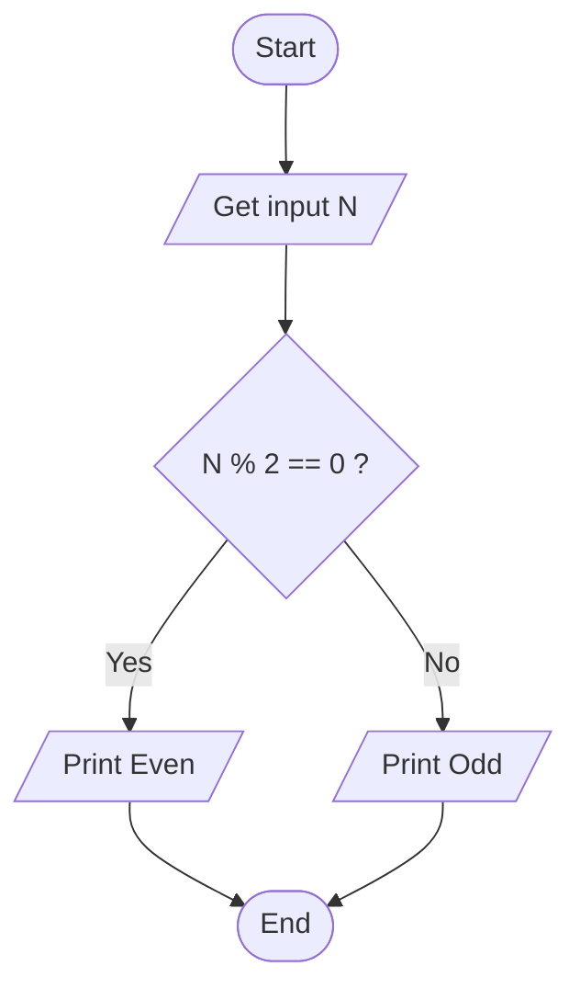

# Workshop: Algorithm and Flowchart

For each question in this workshop, you must complete **two** things:

1.  **Write the pseudocode**
2.  **Draw the flowchart** using either
    - **Option 1:** Draw.io (recommended) → export image → upload to
      your repository → link it in this file
    - **Option 2 (optional):** Write a Mermaid flowchart directly in
      Markdown
    - **Option 3 (optional):** Any other valid method

👉 **IMPORTANT:** At the **bottom of each question**, add the
following sections:

### ✔ Pseudocode

### ✔ Flowchart

---

## 1. Check Even or Odd Number

Design an algorithm and flowchart that take a number as input and
determine whether it is even or odd.

### ✔ Pseudocode

```text
START
    INPUT number
    IF number % 2 == 0 THEN
        PRINT Even
    ELSE
        PRINT Odd
    ENDIF
END
```

### ✔ Flowchart



---

## 2. Calculate Total and Average Marks

Write the algorithm and draw the flowchart for a program that inputs
marks for 3 subjects, calculates the total and average, and displays
both.

### ✔ Pseudocode

```text
START
    SET total = 0 
    FOR counter = 1 TO 3
       totalt+=INPUT("Enter mark for subject " + counter)
    NEXT COUNTER
    DISPLAY("TOTAL: " + total)
    DISPLAY("AVG: " total/3)
END
```

---

## 3. Display Multiplication Table

Create an algorithm and flowchart that input a number and display its
multiplication table from 1 to 10 using a loop.
### ✔ Pseudocode

```text
START
    factor=INPUT("Enter a number: ")
    FOR counter=1 TO 10
        DISPLAY(factor*counter)
    NEXT
END 
```
---

## 4. Positive, Negative, or Zero Check

Write the algorithm and flowchart to input a number and display whether
it is positive, negative, or zero.
### ✔ Pseudocode

```text
START 
    i = INPUT("Enter a number")
    if i > 0
        DISPLAY("The number is positive")
    elseif i < 0 
        DISPLAY ("The number is negative")
    elseif i == 0 
       DISPLAY("The number is zero")
END IF 
```
---

## 5. Simple Interest Calculator

Create an algorithm and flowchart for a program that calculates simple
interest using the formula:

**SI = (P × R × T) / 100**

- **P = Principal** → original amount of money
- **R = Rate of Interest** → percentage per year
- **T = Time** → number of years

### ✔ Pseudocode

```text

START
    p  = INPUT("Principal")
    r = INPUT("Interest Rate / year")
    t = Input("Time in years") 
    SET si = (p * r* t) / 100
    DISPLAY ("Interest rate" + si)
END 
```
---

## 6. Average Temperature Calculation

Write the algorithm and draw the flowchart for a program that takes the
temperature of 7 days, finds the average temperature, and displays it.
### ✔ Pseudocode

```text
START
    SET avg_temp = 0 
    FOR i = 1 to 7
        avg_temp += INPUT("Temperatur for day %i",i)
    NEXT
    DISPLAY ("Average temperature for the week was: " avg_temp/7)
```

## 7. Calculate Area of a Rectangle
### ✔ Pseudocode

```text
Create an algorithm and flowchart to input length and width, calculate
the area (**Area = Length × Width**), and display the result.

START
    length=INPUT("Input length")
    width=INPUT("Width")
    DISPLAY("Area of rectangle", length*width)

```
---

## 8. Determine Pass or Fail

Write the algorithm and draw the flowchart for a program that takes a
student's average marks and displays **"Pass"** if average ≥ 50,
otherwise **"Fail"**.
### ✔ Pseudocode

```text
START
    marks=INPUT("Input average marks")
    if marks > 50
        display("**PASS**")
    else
        display("**FAIL**")
    endif
```
---

## 9. Calculate Factorial of a Number

Write the algorithm and draw the flowchart that input a number and
calculate its factorial using a loop.
### ✔ Pseudocode

```text
START
    SET factorial_number=0 
    number=INPUT("Input a number")
    factorial_number=number
    while number > 0
        set factorial_number=factorial_number*number
    endwhile
    DISPLAY("Resulat: " factoria_number)
END 
```
---

## 10. Calculate Discount on Purchase
### ✔ Pseudocode

```text
Write the algorithm and draw the flowchart for a program that inputs the
purchase amount and gives a **10% discount** if the amount is greater
than 1000.
START
    SET total_due=0
    purchase_amount=INPUT("Purchase amount")
    if purchase_amount > 1000
        total_due=purchase_amount+(purchase_amount*0.1)
    else
        total_due=purchase_amount
    DISPLAY("amount to pay": total_due)
```
        
---


## Optional Exercises (11–16)

## 11. Online Shopping Delivery Eligibility

Write the algorithm and draw the flowchart for a program that inputs a
customer's purchase amount and displays **"Free Delivery"** if the
amount is 500 SEK or more; otherwise display **"Delivery Charge
Applies"**.

---

## 12. Employee Salary and Bonus Calculator

Write the algorithm and draw the flowchart for a program that inputs an
employee's monthly salary and years of service, calculates a bonus of
**10%** for employees with 5 or more years of service and **5%** for
others, then displays the bonus and total salary.

---

## 13. Mobile Data Usage Monitor

Write the algorithm and draw the flowchart for a program that inputs a
user's monthly data limit and data usage, then displays whether the user
has exceeded the limit or how much data remains.

---

## 14. Login System (Maximum 3 Attempts)

Create an algorithm and flowchart for a login system that allows a user
up to 3 attempts to enter the correct password. Display **"Access
Granted"** if the password is correct; otherwise display **"Account
Locked"** after 3 failed attempts.

---

## 15. Store Checkout with Multiple Items

Write the algorithm and draw the flowchart for a program that inputs the
number of items purchased, calculates the total purchase amount using a
loop, and applies a **15% discount** if the total exceeds 5000 SEK.

---

## 16. Electricity Bill Calculator

Write the algorithm and draw the flowchart for a program that inputs the
number of electricity units consumed and calculates the total bill using
the following rates: first 100 units at 1.5 SEK per unit, next 200
units at 2.0 SEK per unit, and all remaining units at 3.0 SEK per unit.

---
